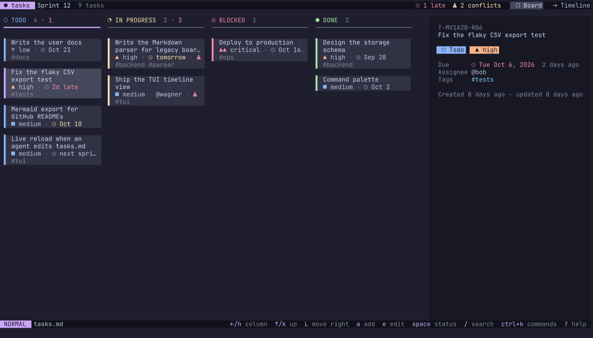
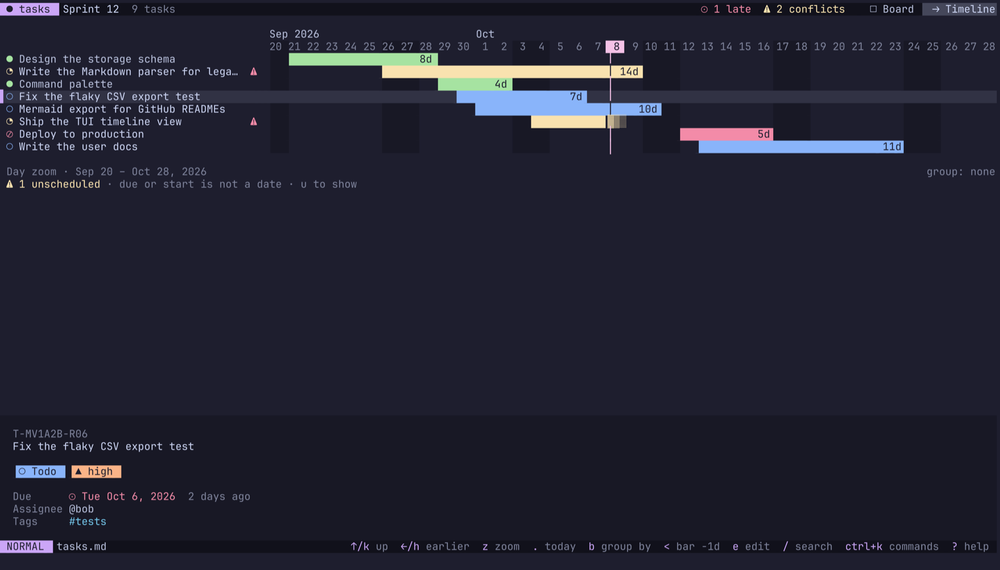
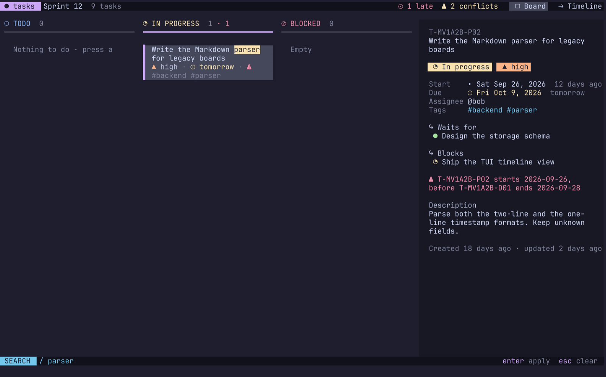
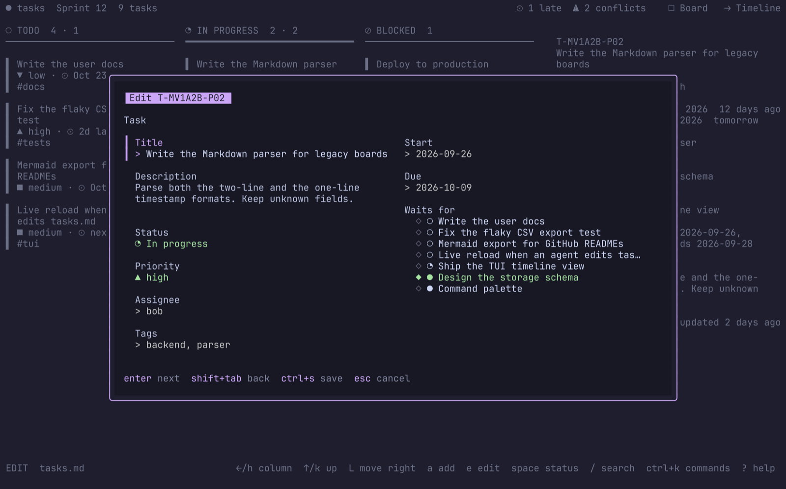
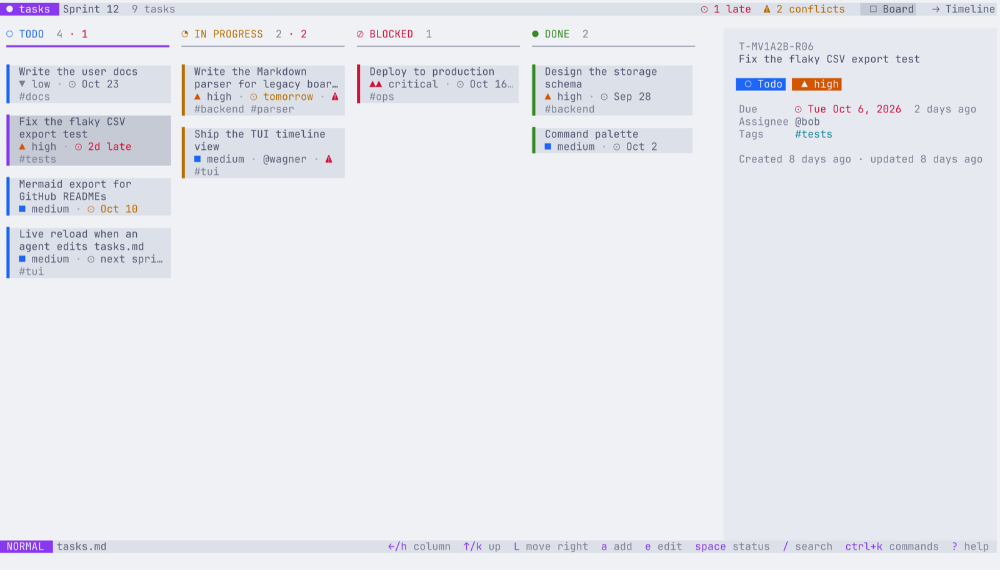

# TUI guide

`tasks tui` opens the board in a full-screen terminal UI. It reads and writes the same `tasks.md` as the CLI, and it reloads the file when another program (for example an AI agent) changes it.

```bash
tasks tui                          # tasks.md in this directory
tasks tui -f ~/work/sprint.md      # another board file
tasks tui --theme nord --icons nerd
```



## Screens

The TUI has two screens. Press `tab` to switch between them, or click a tab in the header. The selected task stays selected when you switch.

### Board

Four columns: TODO, IN PROGRESS, BLOCKED and DONE. Each task is a card:

- A colored edge for the status. The selected card has an accent edge and a lighter background.
- The title, on up to two lines.
- Chips for the priority, the due date and the assignee. A due date is red when the task is late, pink when it is due today, and yellow when it is due within 3 days (in the default themes).
- `↪` when the task waits for a task that is not done. `⚠` when its dates conflict with an `after` link.
- The tags.

A column header shows the number of tasks. A red `· n` after it counts the tasks in that column that are late or in conflict.

The detail pane shows every field of the selected task: dates with relative times, the tasks it waits for, the tasks it blocks, conflicts, and the description. Where the pane goes depends on the terminal size:

| Terminal width | Detail pane |
|---|---|
| 140 columns or more | On the right |
| 100 to 139 columns | At the bottom (or on the right in a short terminal) |
| Less than 100 columns | Hidden; `enter` opens it as an overlay |

In a terminal less than 22 rows high, cards use one line each. A column that does not fit scrolls with the selection and shows `↑ n more` and `↓ n more`.

### Timeline



A Gantt chart of every task with a date. A bar starts on the start date, or on the creation date if the task has no start date. It ends on the due date. A done task without a due date ends on its last update. Other tasks without a due date end today and fade out (`▓▒░`).

- The header shows months on the first line, and days or ISO weeks on the second. Today is a highlighted pill in the header and a line down the chart.
- Weekends have a darker background.
- A bar shows its length in days, for example `14d`.
- The selected row has a lighter background. The tasks that it waits for and the tasks that it blocks show `↪` in their labels. A task with a conflict shows `⚠`.
- Tasks whose due or start date is not a `YYYY-MM-DD` date are listed under the chart. Press `u` to show or hide that list.

Zoom levels: day (3 columns per day), week (1 column per day) and month (1 column per week). The timeline opens at the most detailed zoom that fits all bars.

## Keys

Press `?` in the TUI for this list. Every key does the same thing on every screen, or is used on one screen only.

### Everywhere

| Key | Action |
|---|---|
| `a` | Add a task |
| `e` | Edit the selected task |
| `d` | Delete the selected task (asks first, and lists the tasks that lose their link) |
| `space` | Change the status |
| `enter` | Show or hide the detail pane |
| `/` | Search |
| `ctrl+k` or `:` | Command palette |
| `tab` | Switch between board and timeline |
| `r` | Reload `tasks.md` |
| `esc` | Close an overlay, or clear the search |
| `?` | Help |
| `q` | Quit |

### Board

| Key | Action |
|---|---|
| `↑` `↓` or `k` `j` | Select the previous or next card |
| `←` `→` or `h` `l` | Move to the previous or next column |
| `H` `L` | Move the selected task to the column on the left or right |
| `1` to `4` | Jump to TODO, IN PROGRESS, BLOCKED or DONE |
| `g` `G` | First or last card |

### Timeline

| Key | Action |
|---|---|
| `↑` `↓` or `k` `j` | Select the previous or next bar |
| `←` `→` or `h` `l` | Scroll one step (a day, a week or 4 weeks, by zoom) |
| `{` `}` | Scroll most of a screen |
| `z` | Cycle the zoom: day, week, month |
| `+` `-` | Zoom in or out |
| `.` | Scroll to today |
| `f` | Fit all bars |
| `b` | Group by: none, status, assignee, tag |
| `u` | Show or hide the unscheduled tasks |
| `<` `>` | Move the bar one day earlier or later (start and due) |
| `alt+<` `alt+>` | Move only the due date |
| `[` `]` | Set the start date or the due date to today |

Date changes go through the same validation as the CLI. A change that would put the start after the due date is refused, and a message says why.

## Mouse

- Click a card or a timeline row to select it. Click it again within a moment to edit it.
- Use the wheel to move the selection. On the timeline, hold `shift` (or use a horizontal wheel) to scroll the dates.
- Click a tab in the header to switch screens.

## Search



Press `/` and type. The board and the timeline update as you type, and matches in titles are highlighted. `enter` keeps the search, and `esc` clears it.

| Token | Matches |
|---|---|
| `word` | Title, description or ID contains the word (all words must match) |
| `@alice` | Assignee starts with `alice` |
| `#backend` | A tag starts with `backend` (several tags must all match) |
| `!high`, `!crit` | Priority (several are alternatives) |
| `is:overdue` | Due date is in the past and the task is not done |
| `is:open`, `is:done`, `is:todo`, `is:doing`, `is:blocked` | Status |
| `is:waiting` | Waits for a task that is not done |
| `due:<7d`, `due:>3d` | Due in fewer or more than n days |
| `due:today`, `due:none` | Due today, or no due date |

Example: `parser @bob !high is:open`.

## Editing a task



`a` and `e` open the form over the board. On a wide terminal it has two columns: the task fields on the left, the schedule on the right.

- **Start** and **Due** accept `YYYY-MM-DD` and shortcuts: `today`, `tomorrow`, `+3d`, `+2w`, `+1m`, a weekday such as `fri` (the next one after today), and `next week` (next Monday). The board stores the date as `YYYY-MM-DD`.
- **Waits for** lists the other tasks. Type to filter, and press `space` or `x` to select. A link that would make a cycle is refused while you choose.
- Errors show under the field as you type.
- `enter` goes to the next field and saves after the last one. `ctrl+s` saves from any field.
- `esc` closes a form that has no changes. With changes, the first `esc` asks, and the second one discards them.

An old due date that is not a date (such as `next sprint`) stays as it is while you leave the field alone.

## Command palette

`ctrl+k` lists every action with its key. Type part of a name to filter (`grass` finds "Timeline: group by assignee"), then press `enter`. The palette also has actions without a key:

- Change the theme or the icons for this session.
- Copy the timeline as a Mermaid gantt chart to the clipboard (through OSC 52, so it works over SSH in most terminals).

## Themes and icons



The TUI asks the terminal for its background color, and uses Catppuccin Mocha on a dark background or Catppuccin Latte on a light one. To choose:

```bash
export TASKS_THEME=tokyo-night   # auto, catppuccin-mocha, catppuccin-latte, tokyo-night, nord, mono
export TASKS_ICONS=nerd          # auto, nerd, unicode, ascii
tasks tui --theme nord           # a flag wins over the env var
```

- `auto` icons use Nerd Font glyphs in WezTerm and Ghostty, which ship them, and Unicode glyphs elsewhere. If you see boxes, set `TASKS_ICONS=unicode`.
- `NO_COLOR=1` gives a theme with no colors (bold, faint and reverse only) and ASCII icons.
- Every preset is tested for contrast: body text is at least 4.5:1 against the background, and other colors at least 3:1.

When the terminal window loses focus, the TUI dims until you come back.

## Live reload

The TUI checks `tasks.md` every 2 seconds. When another program changes it, the TUI reloads the file, keeps your selection, and shows a message. If a form is open, the reload waits until you close it.

## Troubleshooting

| Problem | Fix |
|---|---|
| Boxes instead of icons | `TASKS_ICONS=unicode`, or install a Nerd Font |
| Wrong theme for a light terminal | `TASKS_THEME=catppuccin-latte` (some terminals do not report their background) |
| Colors look washed out | Your terminal may only support 256 colors; the TUI adapts, but true color looks best |
| `alt+<` does nothing | Some terminals do not send `alt` with these keys; use the command palette |
