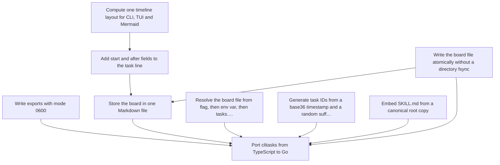

# Decision records

<!-- Generated by `adrlog index`. Do not edit by hand. -->

| Record | Status | Date | Tags |
|---|---|---|---|
| [Compute one timeline layout for CLI, TUI and Mermaid](20261004-132518-compute-one-timeline-layout-for-cli.md) | accepted | 2026-10-04 | timeline, architecture |
| [Add start and after fields to the task line](20261004-132518-add-start-and-after-fields-to.md) | accepted | 2026-10-04 | storage, timeline |
| [Write the board file atomically without a directory fsync](20261004-131735-write-the-board-file-atomically-without.md) | accepted | 2026-05-17 | storage, durability |
| [Write exports with mode 0600](20261004-131735-write-exports-with-mode-0600.md) | accepted | 2026-05-17 | security |
| [Store the board in one Markdown file](20261004-131735-store-the-board-in-one-markdown.md) | accepted | 2026-05-16 | storage |
| [Resolve the board file from flag, then env var, then tasks.md](20261004-131735-resolve-the-board-file-from-flag.md) | accepted | 2026-05-17 | cli |
| [Generate task IDs from a base36 timestamp and a random suffix](20261004-131735-generate-task-ids-from-a-base36.md) | accepted | 2026-05-17 | storage |
| [Embed SKILL.md from a canonical root copy](20261004-131735-embed-skill-md-from-a-canonical.md) | accepted | 2026-05-17 | agents, build |
| [Port clitasks from TypeScript to Go](20261004-131728-port-clitasks-from-typescript-to-go.md) | accepted | 2026-05-16 | architecture, language |

## Graph

